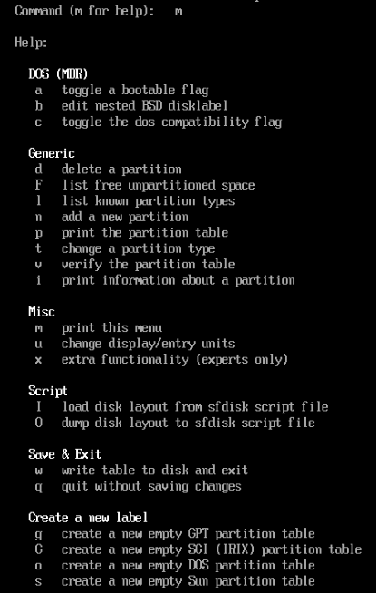
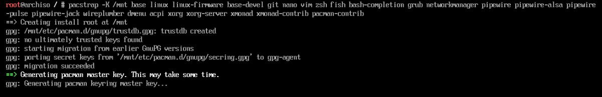
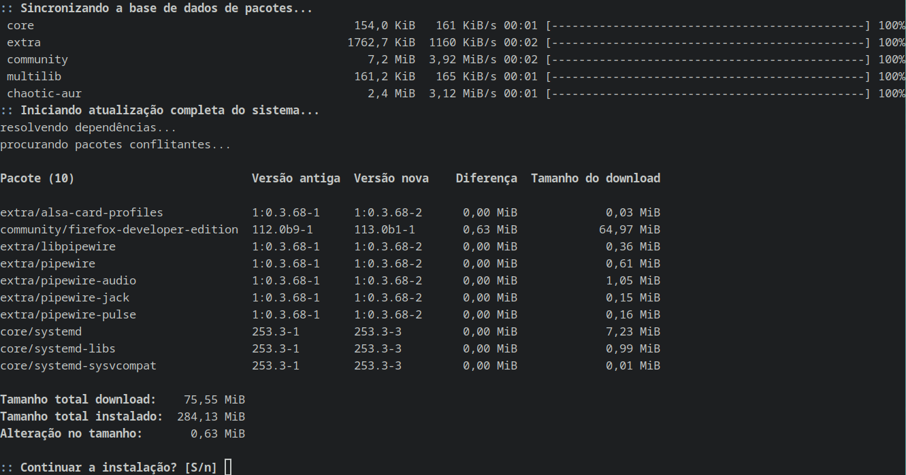

# ArchLinux-PersonalInstalationGuide

Guia pessoal de instalação com os comandos geralmente usados e com base na ArchWiki oficial para me guiar.

# _________________________________________________________________

## -|Instalação do Arch Linux|-

Baseado na [ArchWiki](https://wiki.archlinux.org/title/Installation_guide) em inglês.

+ *Primeiro de tudo é necessário formatar um pendrive para fazer o boot da ISO desejada, só depois dá pra adicionar a ISO. Eu utilizei o [Ventoy](https://www.ventoy.net/en/index.html) para formatar. Com o [Ventoy](https://www.ventoy.net/en/index.html) é possível usar vários tipos de ISO e distros diferentes.*

+ *Caso seja necessário, é possível aumentar o tamanho da fonte dentro da ISO de acordo com a sua preferência utilizando o **‘setfont’**, mais detalhes na página da ArchWiki na sessão 3.1: [ConsoleFonts](https://wiki.archlinux.org/title/Linux_console#Fonts).*

+ *Algumas vezes pode ocorrer algum problema com a ISO, esses problemas são resolvidos fazendo a atualização das keyrings/chaves baixando o pacote **'archlinux-keyring'**, depois é só iniciar e popular pelo pacman. Mais informações na ArchWiki, sessões 1.2 e 2.1: [Keyring: Init e Populate](https://wiki.archlinux.org/title/Pacman/Package_signing).*

---
---
---

### 1)	Começar a instalação ajustando o teclado.

Inicialmente a modificação do teclado é feita por 2 motivos, o primeiro é para ter acesso a alguns símbolos que não tem por padrão dependendo do teclado que está sendo utilizado por padrão, o segundo é para ficar mais simples de se localizar já que cada pessoa tem um certo costume com um tipo de teclado.

Para pesquisar a os teclados disponíveis utilizamos o comando:

	ls /usr/share/kbd/keymaps/**/br*.map.gz

> - ***kbd**: É utilizado para pesquisar os teclados disponíveis em todos os idiomas que tem no banco de dados.
> 
> - ***br**: Você pode modificar a sigla para o idioma desejado, br pesquisa em português brasileiro. 

Se você quiser pesquisar todos os idiomas disponíveis, é só deixar o comando sem o **‘br’**, como é mostrado abaixo.

	ls /usr/share/kbd/keymaps/**/*.map.gz

Para selecionar o teclado desejado, basta adicionar o comando abaixo:

	loadkeys br-abnt2
 
A opção de **‘loadkeys’** serve para ativar o telado e a opção de **‘br-abnt2’** seleciona a opção de português brasileiro, outro exemplo de idioma seria o **‘de-latin1’** que é usado como padrão pela ArchWiki em inglês.

Esse é o básico de como ativar o teclado em outro idioma para você ter acesso a símbolos como: **‘|’, ’/’** e **‘ç’**.

---
---
---

### 2)	Em seguida verificar a conexão com a internet

Para iniciar a verificação de conexão com a rede podemos utilizar o comando:

	ip link

O ‘ip link’ verifica se a conexão é por Wi-Fi(wlan0) ou a cabo(eth).

> *"Se aparecer como **‘DOWN’** não há conexão nenhuma. Se aparecer **‘UP’** tem conexão com a internet. você vai saber se é a cabo ou Wi-Fi com base na descrição da conexão.*
> 
> *Abaixo segue um exemplo de conexão somente pelo Wi-Fi:*

> *Quando ambas as conexões estão ativas aparece tudo **‘UP’**, quando ambas estão inativas aparece tudo **‘DOWN’**, e quando é só uma das duas que está ativa só aparece **‘UP’** em uma das duas."*
> 
Após verificar a situação da sua conexão basta conectar utilizando os programa de conexão desejado *(iwctl, mmcli, systemd-networkd, etc...)*, abaixo segue o exemplo de conexão pelo **‘iwctl’**, ~~(ele deixa a senha oculta e eu acho bonitinho)~~:
 
	iwctl
---
	device list

> *"Se a rede de Wi-Fi estiver aparecendo como **‘Powered off’** vai ser preciso ativar para ficar como **‘Powered on’**, para isso basta usar os comandos abaixo:*

	device wlan0 set-property Powered on
---
	adapter NomeDaPlacaWiFi set-property Powered on

> *Esses comandos vão ativar tanto a sua placa de Wi-Fi quanto a sua rede para o seu computador conseguir reconhecer e se conectar corretamente."*

Esse comando abaixo serve para escanear as redes Wi-Fi disponíveis, mas não vai mostrar nada, ele só serve para o programa saber que elas existem.

	station wlan0 scan

Já o comando que realmente te mostra as redes disponíveis para então selecionar a rede Wi-Fi desejada.

	station wlan0 get-networks

Para se conectar a rede é só usar o camando abaixo que faz a conexão e em seguida solicita para você a senha, caso tenha senha no Wi-Fi.

	station wlan0 connect NomeDaRedeWifi

Quando você conecta na rede wifi ele solicita a senha em seguida, mas caso você não queira ter que colocar a senha só depois, basta fazer o comando direto, mas a senha não vai ficar escondida. O comando direto é:

	iwctl —passphrase SenhaDoWiFi station wlan0 connect NomeDoWiFi

Dessa forma você conecta direto no Wi-Fi e a senha fica visível também, além de ser um comando direto que você faz de uma vez só.

> ***"Lembrando que é sempre bem mais fácil olhar os comandos na ArchWiki: [iwctl](https://wiki.archlinux.org/title/Iwd#iwctl)."***
> 
---
---
---

### 3)	É importante sincronizar os relógios e o calendário corretamente

Agora seguindo para as configurações de data e hora é essencial entender que o seu computador precisa estar sincronizado para conseguir fazer o download de pacotes corretamente, caso contrário a conexão com o servidor global pode apresentar erros e falhas de conexão.

Para realizar esse processo então utilizamos o **‘timedatectl’** que basicamente é um sincronizador global, inclusive tem uma diferença entre o horário local e o global.

Por isso para ter o horário local configurado é necessário selecionar uma **‘timezone/zona do tempo’** que é basicamente a sua localização global com relação ao 
Meridiano de Grennwich ~~(a linha central do planeta, utilizada para calcular o horário terrestre de acordo com sua localização geográfica no planeta)~~, para isso vamos utilizar a sequência de comandos abaixo:

> Para saber como está a situação da sua data e hora:

	timedatectl ou timedatectl status

> Para sincronizar seus relógios e data:

	timedatectl set-ntp true

> Para poder verificar uma lista com as timezones disponíveis:

	timedatectl list-timezones | grep America

> *"Utilizamos o ‘| grep America’ para filtrar a lista somente para o continente Americaco, caso seja de sua escolha basta colocar o nome do continente desejado no final do comando, como por exemplo ‘| grep Europe’ para ter uma lista das localidades europeias."*

Comando absoluto para selecionar a zona continental **(America)** e a zona local **(São Paulo)** de acordo com sua preferência e a lista de zonas gerada anteriormente:

	ln –sf /usr/share/zoneinfo/America/Sao_Paulo /etc/localtime

> *"A zona que geralmente utilizamos como padrão no Brasil é São Paulo, mas caso haja alguma diferença de horário na sua cidade com relação ao horário de brasília, basta verificar na lista Americana a mais próxima a sua cidade."*

Abaixo tem um print de como você iria visualizar essa parte da configuração durante a sua instalação do ArchLinux pela ISO:

Não tem muito segredo no **‘timedactl’**, é basicamente isso e inclusive você até pode fazer essa parte depois de selecionar a zona, mas a sincronização do hardware com o servidor global é essencial.

---
---
---

### 4)	Atenção na criação e organização das partições para dar boot corretamente

Iniciamos o processo de particionamento conhecendo o nosso disco, o HD ou SSD, a listagem de blocos é feita com o *‘lsblk’* assim conseguimos visualizar todos os discos conectados a placa mãe e as partições já existentes.

> Lista os blocos/partições existentes:

	lsblk

>  *"Abaixo segue o print de um exemplo de blocos listados em uma Máquina Virtual (VM), o nome do disco é ‘vda’ e tem um espaço de 40 gigabytes.*
> 
> *O linux consegue rodar o sistema em em discos com espaços pequenos sem problemas e a VM está sendo utilizada para ilustrar o que vai aparecer quando fazemos isso em um computador.* 
> 
> *Cada computador nomeia o seu disco de uma forma diferente, para identificar basta verificar o tamanho do volume, geralmente eles são a partir de 256 gigabytes."*

---

> *"Sobre o **‘fdisk’** existem outros programas de particionamento como o **‘parted ou cfdisk’**, mas eu utilizo o **‘fdisk’**, ele é um programa de particionamento, você acessa ele e dentro dele tem comandos próprios que podem ser utilizados, basta digitar **‘m’** para ter um guia/lista de comandos.* 

> *Tem duas formas de sair do programa também que é importante prestar atenção: **‘w’** sai e salva tudo que você modificou; **‘q’** sai sem salvar nenhuma alteração nas partições ou disco existente."*

---

> Para entrar no **‘fdisk’**, iniciar o programa de partições e selecionar o disco que você vai dividir/particionar:

	fdisk /dev/sdx

*"Abaixo o print de exemplo ao entrar no particionamento de discos pelo **‘fdisk’**."*

Cada partição tem uma forma específica de ser formatada e montada, também é possível nomear suas partições para facilitar a identificação dela e para o que você está utilizando cada coisa.

As 3 formas de montagem mais comuns são **ROOT, SWAP** e **BOOT**. São as mais utilizadas e básicas que se pode aprender a fazer.

> - **ROOT:** *É a partição raiz onde são registrados os arquivos do sistema, pastas de usuários, etc...*
> 
> - **SWAP:** *Memória RAM a mais que pode ser adicionada manualmente, essa memória é adicionada como uma extensão do disco (HD ou SSD).*
> 
> - **BOOT:** *O sistema de inicialização que garante que os arquivos do sistema operacional não serão corrompidos e irá iniciar com segurança.*

Para criar partições utilizamos o comando **‘n’** dentro do **‘fdisk’**, em seguida começamos a configuração de numeração e tamanho da partição.

Eu decido o tamanho das minha partições pelo que eu vou precisar para o meu sistema, mas o básico que o **‘boot’** precisa no mínimo por padrão é 300Megabytes; uma *‘swap’* razoável utiliza de 4G a 2Gigabytes ~~*(depende do quanto você ja possui de RAM e o total que você quer ter)*~~; o **‘root’** pode ficar com todo o espaço restante do HD ou SSD, então não é necessário colocar um valor nele, por isso eu geralmente faço o **‘root’** por último e faço a numeração das partições da última para a primeira, como eu faço só 3 inicio criando a número 3, vou para o 2 e deixo sempre o **‘root’** como 1.

Para criar basta entender o seguinte:

> - **n** = *Cria uma nova partição*
> 
> - **Partition type: ‘p’** ou **‘e’** = *A menos que você saiba e vá fazer um contêiner, pode selecionar a padrão apertando a tecla ‘enter’ ou ‘p’ que é a partição primária.*
> 
> - **Partition number (1-4, default 1)** = *A menos que você ligue, você pode seguir a ordem de numérica que quiser, basta você se lembrar o que cada número significa (se é root, boot ou swap), ou verificar usando o lsblk antes de formatar cada partição.*
> 
> - **First sector (2048-83886079, default 2048)** = *A menos que você saiba o que está fazendo ou queira fazer uma configuração muito específica, é só seguir em frente e deixar o padrão que é 2048 apertando ‘enter’.*
> 
> - **Last sector, +/-sectors or +/-size{K,M,G,T,P} (2048-83886079, default 83886079)** = *Quantidade de kbytes, megabytes, gigabytes, trabytes ou terabytes a ser selecionado. Para colocar o número que deseja basta escrever assim: +300G (para 300 gigabytes recomendado para boot); +4G (4 gigabytes,recomendado para swap).*

Basicamente é só isso que você precisa saber para montar suas partições independente do espaço disponível no seu HD ou SSD, lembrando que se você tiver mais espaço disponível sempre pode aumentar o tamanho da sua **‘swap’** e deixar o restante todo para o **‘root’**.

Abaixo tem um exemplo de como criar partições, lembrando que eu faço na ordem contrária, sendo do 3 ao 1, iniciando pelo boot, seguido do swap e por último o root.

Lembre-se de salvar utilizando a letra **‘w’** para salvar e sair do **‘fdisk’** sem perder as modificações que você já fez. Abaixo tem um print de exemplo:

Agora que as partições já foram criadas é só formatar as partições e nesse processo também podemos nomear elas da forma que quisermos.

Eu geralmente formato somente o **‘root’** como **‘.btrfs’**, o **‘boot’** eu formato como **‘.ext4’** e o **‘swap’** tem uma formatação própria, essa parte de **‘.btrfs’** ou **‘.ext4’** também depende de como você vai utilizar o seu sistema e se vai ser necessário uma formatação específica para alguma configuração específica que você for usar. Caso contrário esse tipo de formatação é o suficiente para utilizar no dia a dia.

Vale resaltar que você precisa saber o nome com numeração das suas partições na lista, os comandos utilizados são:

**lsblk** = Para saber o nome das suas partições e já verificar se elas foram criadas corretamente. Elas vão aparecer igual no print abaixo:

> Formatação do root:

	mkfs.btrfs -L HD-SSD /dev/vda1

> Formatação do swap:

	mkswap –L Swap /dev/vda2

> Formatação do boot:

	mkfs.ext4 -L Boot /dev/vda3

*"Caso dê algum erro na formatação do tipo '.ext4' é recomendado formatar assim:*

	mkfs.fat -F32 /dev/vda3

*Esse tipo de formataçãotambém funciona muito bem para o boot, então se ocorrer qualquer erro basta desmontar e remontar como '.fat' para corrigir."*

Agora estamos prontos para a montagem dos discos, no final de cada processo aparece se o nome foi dado corretamente como você pode ver nos prints acima.

---
---
---

### 5)	Montagem das partições para iniciar a instalação

São utilizados 3 comando para fazer a montagem de discos, um para **‘root’**, um para **‘swap’** e um para **‘boot’**. Assim é possível acessar corretamente cada partição para o computador conseguir utilizar toda sua capacidade.

> Para o ROOT:

	mount /dev/sdx1 /mnt

> Para o SWAP:

	swapon /dev/sdx2

> Para o BOOT:

	mount —mkdir /dev/sdx3 /mnt/boot/efi

*" Caso você queira na montagem do **‘boot’** pode adicionar a **‘/efi’**, mas ela é opcional e a menos que você esteja fazendo especificamente para usar com **‘efi’** não é necessário."*

Após fazer os comandos basta verificar se os blocos foram montados corretamente utilizando o **‘lsblk’** como no print abaixo:

Caso precise desmontar algum volume, basta fazer os comandos abaixo, veja também o print de exemplo:

> Serve para root e boot basta mudar a partição:

	umount /dev/sdx1

> Serve para o swap:

	swapoff /dev/sdx2

---
---
---

### 6)	Iniciar a instalação do ArchLinux

> *"Observação: Eu uso os mirrors/espelhos padrões do sistema, então eu não faço a seleção dos espelhos, listagem ou configuração. Mas vou deixar um passo a passo básico para quem gosta de usar!"*

#### 6.1 -| Como trocar os Mirrors e fazer MirrorList |-

**_____________________________ [O que são?] ______________________________**

*- Os mirrors/espelhos são os servidores que se conectam ao seu programa de atualizações do sistema (pacman, apt, etc) para poder ter uma conexão com os arquivos a serem atualizados, de forma que o processo de atualização ou instalação de arquivos pode variar na velocidade de acordo com o mirror selecionado (nacional ou internacional). Mirrors regionais tendem a ter uma velocidade maior de conexão então as instalações são mais rápidas por consequência.*

---

__________________________{Passo a Passo}

~> Ir para o diretório onde estão os mirrors, geralmente fica no diretório **'/etc/pacman.d'**, é o caminho padrão do sistema do ArchLinux;

~> Neste diretório existem alguns arquivos já gerados automaticamente, mas o que vamos fazer independente de ser manual ou com comandos absolutos é criar o arquivo de configuração do mirrorlist. Se ele já existir só vai ser atualizado;

+ *{Opção manual direto no arquivo de configuração e pelo site}*

~> No site '[ArchLinux.org](https://archlinux.org/)' você vai até o '[Mirrorlist Updater](https://archlinux.org/mirrorlist/)' e faz a seleção dos mirrors que você deseja, basta selecionar o país de sua escolha, selecionar as opções desejadas de protocolo e versão IP *(http, https, ipv4 ou ipv6*) e clicar em **Gerar Lista/Generate List**. Quando a lista for gerada é só copiar e colocar no arquivo de configuração **'mirrorlist'**;

	vim /etc/pacman.d/mirrorlist

~> No arquivo de configuração do mirrorlist é só colocar os mirrors copiados e descomentar para ativar as opçẽs corretamente;

+ *{Opção gerando pelo reflector e rankmirror}*

~> Na opção do rankmirrors esse comando:

	rankmirrors —verbose -n 10 /etc/pacman.d/mirrorlist

Gera os mirrors desejados mais rápidos e na quantidade desejada, então se você mudar o número 10 para 5, a lista que será gerada vai ser dos 5 mirrors, quando indicamos a pasta no fim do comando também podemos indicar onde vai ser salvo, podendo ser em um arquivo novo ou no escolhido;

~> Na opção de gerar os mirrors pelo reflector é bem parecida com o rankmirrors, são gerados os mirrors mais rápidos e salvos no local que você desejar. O comando a ser usado é:

	reflector —verbose —latest 10 —protocol https —sort rate —save /etc/pacman.d/mirrorlist

E assim como o mirrorlist você consegue escolher a quantidade que você deseja que seja listada, mas também o tipo de mirror que pode ser https ou http, fora o sort;

> **________________{Observações adicionais}**
> 
> ~> *"Caso você não tenha selecionado os mirrors durante a instalação os mirrors padrões do seu sistema são os do reflector, essas opções de modificação serve pra qualquer tipo de caso, desde você ter mudado na instalação ou não;"*
> 
> ~> *"É importante você decidir se para o seu gosto pessoal vai valer a pena ou não a modificação dos seus mirrors, caso esteja te suprindo é okay, mas caso contrário siga corretamente o processo de modificação para não ocorrer um problema maior a longo prazo;"*
> 
> ~> *"Quando você gera os mirror pelo reflector e pelo rankmirrors tem uma segurança maior de velocidade e funcionamento, já que essas duas opções testam justamente isso e manualmente a margem de erro aumenta. Enfim, é isso, sejam felizes com os mirrors que quiserem usar da forma que desejarem usar!"*

---

#### 6.2 -|Pacstrap|-

Para fazer a instalação do arch é usado geralmente o **‘pacstrap’**, nele instalamos os pacotes de base, o linux e também pacotes não essenciais. Com esse comando também conseguimos por a interface gráfica (GUI) desejada, usando: *Gnome, Plasma, xorg, wayland, etc...*

Antes de fazer a instalação, você pode modificar o arquivo de configuração para descomentar a linha **‘37,1’** do **‘ParallelDownloads=5’** para fazer os downloads mais rápido. Para acessar o arquivo basta usar o comando:

	vim /etc/pacman.conf

Agora é só descomentar a linha desejada apagando o símbolo **‘#’** e é só digitar **‘:x’** para sair e salvar como no print abaixo:

---

> *" Importante: Caso você esteja usando uma ISO que você baixou a muito tempo vai ser preciso atualizar e sincronizar, caso contrário vai dar erro e não vai instalar nada. O comando é:*
> 
	pacman –Sy archlinux-keyring
> 
> > *Algumas vezes também é necessário renovar as chaves usando:*
> 
	pacman-key —init
> 
	pacman-key —populate
> 
> *Isso deve ser o suficiente para resolver 80% dos problemas. Caso não funcionar de nenhum jeito, vale mais a pena renovar a ISO, senão o processo vai ser maior e mais manual."*
> 
---

Agora para iniciar a instalação o comando que utilizamos é o seguinte:

	pacstrap –K /mnt

Após esse comando é só adicionar os programas de sua preferência, começando pelos de base, senão o sistema não vai ser instalado corretamente. Segue o comando com as configurações abaixo:

> Esse é o comando só com os essenciais para o linux rodar sem sistema gráfico nenhum, sem programas, sem gerenciadores nem nada, ou seja pelado:

	pacstrap –K /mnt base linux linux-firmware

> Esse comando tem minhas configurações pessoais:

	pacstrap –K /mnt base linux linux-firmware linux-headers base-devel git nano vim zsh fish bash-completion grub efibootmanager networkmanager pipewire pipewire-alsa pipewire-pulse pipewire-jack wireplumber dmenu acpi xorg xorg-server xmonad xmonad-contrib pacman-contrib 

Segue abaixo a grafia de como vai ficar o comando e após dar **‘enter’** e a tela que aparece antes de iniciar os downloads, se tiver algum erro no nome de algum programa o processo não vai iniciar, por isso é indicado pesquisar a forma correta de escrever ou remover ele da lista e instalar depois. Veja os dois prints a seguir:

---

Ao finalizar a instalação vamos seguir para configurar o sistema antes de reiniciar, é importante lembrar de não reiniciar ainda a menos que você queira refazer tudo de novo agora!!!

---
---
---

### 7)	Configurar o sistema antes de reiniciar

Começamos com um comando que cria um sumário de tudo que tem no computador, para ser montado quando for inicializado.

	genfstab –U /mnt >> /mnt/etc/fstab

> Para mudar da ISO para o HD/SSD físico do PC e fazer o gerenciamento e organização.

	arch-chroot /mnt
---

> Agora iniciamos gerando a linguagem e organizamos o teclado:

	vim /etc/locale.gen

Basta descomentar a linguagem desejada removendo o símbolo de **‘#’** no arquivo de configuração e salvar usando o **‘:x’**, assim como no print abaixo:
 
 
 
 
 
Abaixo usamos o comando para gerar todas as linguaens que foram descomentadas e salvas no arquivo de configuração, é uma forma de ativar elas para serem utilizadas no sistema. Veja o comando e o print a seguir:

	locale-gen

Vamos utilizar o comando **‘echo’** que direciona tudo o que foi escrito para o local que desejamos. Com ele vamos configurar a linguagem padrão do sistema, o mapeamento de teclado padrão do sistema e o nome do Host/Dono do sistema, é o nome do seu computador para outras pessoas.

Para definir a linguagem do sistema, note que é só colocar após o sinal de **‘=’** o nome da linguagem no formato de sigla seguido da marcação **‘.UTF-8’**, para indicar o idioma e formato:

	echo “LANG=pt_BR.UTF-8” > /etc/locale.conf

Para definir o mapeamento do teclado é só definir após o símbolo de **‘=’** sem mais indicativos além do formato de teclado:

	echo “KEYMAP=br-abnt2” > /etc/vconsole.conf

Para dar um nome de Host/Dono só é necessário deixar o nome entre parenteses:

	echo “ArchFox” > /etc/hostname

Note que em todas as opções utilizamos o símbolo **‘>’** e o local absoluto de armazenamento em seguida como **‘/etc/locale.conf’**, **‘/etc/vconsole.conf’** e **‘/etc/hostname’**, isso é muito importante para que seja salvo corretamente todas as configurações que você fez anteriormente.

Agora chega minha parte favorita de configurar o Pacman no **PACMAN**ager, pacman é uma sigla para **‘gerenciador de pacotes/pack manager’**, o que vou fazer é ativar uma opção que faz aparecer um desenho de pacman quando os programas são instalados e atualizados, também vou ativar os módulos: **‘Color’**, **‘ParallelDownloads’** e **‘Verbose’**. Esses módulos servem para deixar mais colorido, acelerar os downloads e ajudar a visualizar melhor o que cada comando faz.

Exemplo de como vai aparecer pelo terminal:

> Para isso faremos algumas mudança no arquivo de configuração do **‘pacman’** novamente pelo comando:

	vim /etc/pacman.conf

A sessão que vamos modificar é da linha 31 até a linha 37, então vamos adicionar mais uma linha que vai ser a 38, basta descomentar os módulos: **‘Color’**, **‘VerbosePkgLists’** e **‘ParallelDownloads’**.

> Para poder modificar o arquivo, basta usar o comando:

	i

> Na linha abaixo de **‘ParallelDownloads’** adicione na linha 38 a frase e pule uma linha, a frase é:

	ILoveCandy

Faça como no print abaixo:

Fora o **‘ParallelDownloads’** (que pode ter o número de downloads alterado para qualquer outra numeração que você queira), esses passos são opcionais, já que: a opção **‘Color’** só serve para deixar as coisas mais coloridas no terminal, e isso ajuda a visualizar independente do shell que você for utilizar; a opção **‘VerbosePkgLists’** só serve para ter mais texto explicado o que cada comando faz ou os processos que estão sendo realizados de uma forma mais visível; e a opção de adicionar a linha **‘ILoveCandy’** é por pura diversão para ver o pacman comendo as bolinhas durante as atualizações/downloads de pacotes.

Gosto de ativar essas opções porque me ajudam a aprender e me sentir mais confortável sobre arquivos de configuração e me fazem sentir mais cofiante na hora de modificar sozinha por exemplo.

Agora vamos para os gerenciamentos de administrador. Para isso também vamos modificar um arquivo de configuração chamado **‘sudoers’**, nesse arquivo vamos descomentar a linha **‘wheel’** ou **‘roda’** que é basicamente a lista VIP de usuários, quando descomentamos ela podemos gerenciar as permissões que cada usuário tem no computador, ao que eles terão acesso ou não.

Para editar o arquivo responsável pelos administradores vamos usar:

	vim /etc/sudoers

Agora é só descomentar a linha **‘85,1’** como no print abaixo:

*" É importante entender que existem várias linhas relacionadas ao grupo wheel/administradores, a linha descomentada abaixo foi a **'85,1'** que garante acesso a tudo do sistema quando o usuário é adicionado ao grupo wheel/administradores.*

*Leia atentamente o que você está descomentando e para quem você está dando cada permissão e acesso ao criar um novo usuário que não seja o seu pessoal."*

Ao sair lembre-se de apertar **‘esc’** seguido de **‘:x’** para salvar todas as alterações ao sair do arquivo de configuração.

O próximo passo é criar uma senha de ADM utilizando o comando:

	passwd

> *Ativa a criação de senha e te pede para adicionar e confirmar ela, a senha fica escondida como no print abaixo:*

Agora vamos criar um usuário, já adicionar como menbro do grupo **‘wheel’** e criar o diretório do usuário, sendo por que no final do comando também criamos o nome do usuário, fazemos isso usando o comando:

	useradd –G wheel –m –d /home/PastaDoUsuário NomeDoUsuário

A semântica segue a ordem seguinte:

> - **useradd** = *Adicionar usuário.*
> 
> - **-G** = *Adicionar ao grupo.*
> 
> - **wheel** = *Nome do grupo.*
> 
> - **-m** + **-d** = *Criar e adicionar um diretório.*
> 
> - **/home/NomeDaPasta** = *Diretório absoluto de onde vai ficar o usuário, ou seja na pasta ‘/home/’ e vai ser criada a pasta do usuário conforme os dois comandos anteriores.*
> 
> - **Espaço** e **NomeDoUsuário** = *Isso serve para gerar um nome que vai ser o que você vai usar para logar no seu usuário e colocar a senha dele.*

O retorno que o terminal vai te dar não vai ser nada, mas se tiver um erro vai aparecer na tela, quando é criado corretamente fica assim:

Agora é só gerar uma senha para o usuário com o comando e nome do usuário, lembrando que se o usuário não for criado vai dar erro na hora de gerar uma senha, mas o comando é assim:

	passwd NomeDoUsuário

Agora vamos para a configuração do [Grub - ArchWiki](https://wiki.archlinux.org/title/GRUB) as sessões que vamos usar são: **‘1’** e **’2.3’**. Lembrando que se você não estiver na máquina virtual, vai precisar fazer essa etapa seguindo os passos abaixo para **‘efi’**:

	grub-install —target=x86_64-efi —efi-directory=/boot/efi —bootloader-id=NomeDoHost —removable
---
	grub-mkconfig –o /boot/grub/grub.cfg

Para o legacy *(eu não uso a menos que esteja em VM, que é o padrão)*:

	grub-install --target=i386-pc /dev/sdx
---
	grub-mkconfig –o /boot/grub/grub.cfg

_________________{Em caso de Dual Boot – Dois Sistemas}

Para detectarmos outros sistemas sem erros para eles coexistirem é necessário modificar o arquivo de configuração do grub, editamos pelo comando abaixo:

	vim /etc/default/grub

Basta descomentar a linha **‘63,1’**:

> GRUB_DISABLE_OS_PROBER=false

Essa linha que descomentamos acima serve para detectar outros sistemas.

Só é necessário realizar esse processo no caso de você desejar ter 2 ou mais sistemas na mesma máquina, por exemplo: **‘ArchLinux’** e **‘Windows’**.

---
---
---

### 8)	Reinicialização

Agora é só sair do **‘arch-chroot’** digitando:

	exit 
---
	Outra opção é apertar as teclas: ctrl+d

Depois é só digitar:

	reboot

Seu computador vai reiniciar e ao iniciar o sistema já vai estar instalado e ativo, já pode remover o pen-drive se estiver usando um com a ISO.

---
---
---

### 9)	Pós-Instalação

# Esta sessão ainda está em desenvolvimento, recomendo fortemente que você utilize um auxilio melhor para configurar o seu sistema e use um arquivo de configuração de seu agrado pelo 'git clone'!

---

Nessa hora é uma boa ideia já ter suas configurações próprias prontas, o Arch basicamente vai ser instalado sem nenhuma interface e se você utilizar interfaces que você precisa configurar já é bom fazer com antecedência e deixar disponível no seu github ou gitlab. A menos é claro que você saiba construir seu código pessoal de cabeça.

Bom, caso você esteja usando alguma interface gráfica já pronta, basta ativar ela. Caso contrário, vamos ao rolê agora.

---
---
---

### 10)	Organização da interface gráfica e visual

Essa parte é um pouquinho mais fácil, é a hora da gente ficar mexendo no que quiser pra deixar mais bonitinho, então vou dar algumas opções.

> - Mexer direto no arquivo de configuração dos modificadores do seu sistema, ex: xorg,xmonad,xmobar,polybar;
> 
> - Mexer nas configurações usando arquivos pré-prontos já com um design definido, ex: dotfiles/arquivos de configuração, backup de um sistema, etc;
> 
> - Utilizar programas para configurar o seu desktop, ex: nitrogen, pcmanfm, lxappearance, etc;

O jeito mais certeiro é ter uma pré-configuração já pronta com suas preferências, chamamos essas pré-configurações de dotfiles, mas eu prefiro dizer que é um arquivo de configuração.

Tem várias formas de criar e alocar eles, o que eu prefiro é deixar alocado em um lugar de fácil acesso pelo terminal e com backup garantido, fora que seja fácil de manter atualizado. Por isso é muito fácil encontrar esses tipos de arquivos no github ou no gitlab por exemplo.

É importante ter uma ideia do que você vai precisar para o seu computador, já que nesses arquivos não tem somente a aparência dele, você também pode deixar scripts de configuração do sistema e pastas com as suas configurações pessoais para aparelhos USB, etc...

Essa é a hora de você criar e explorar mesmo, ter ideias e testar essas ideias.

Vou deixar um exemplo de como implementar alguns dots do github pelo terminal. O processo é bem simples de se fazer.

